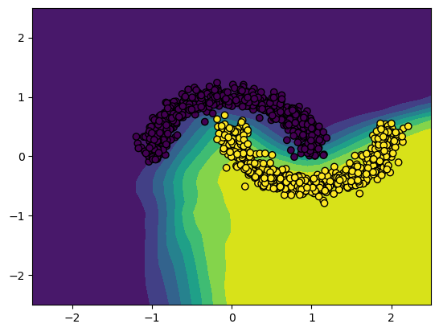

# Tiny

A tiny deep learning framework using numpy as backend. It has a matrix (only 2D)
autograd engine inspired by Andrej Karpathy's
[micrograd](https://github.com/karpathy/micrograd) and a pytorch like API

## Why another deep learning framework?

There's no need to for a new deep learning framework but it is useful as a
learning tool.

## Demo

The file `demo.ipynb` has a demo classification problem.

## Test

Run test against pytorch

`python test.py`

